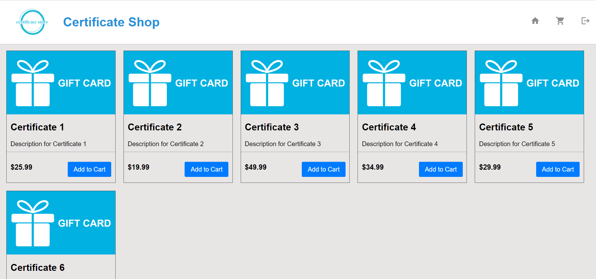
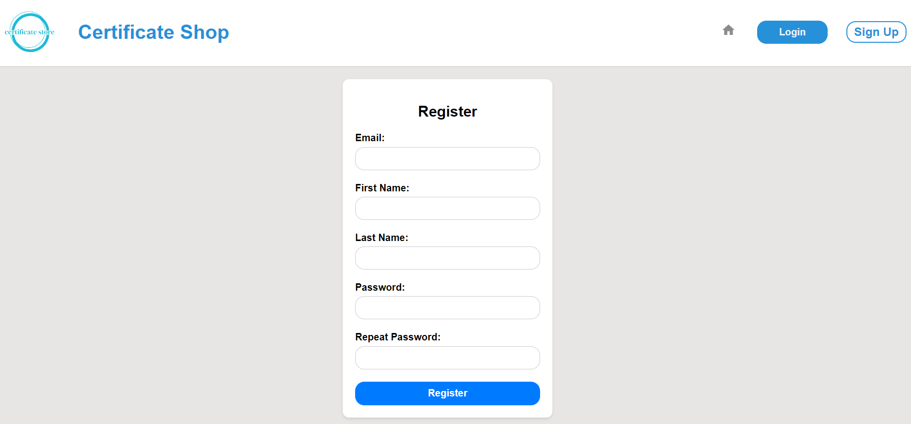
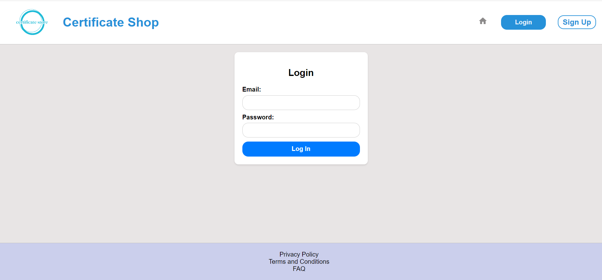
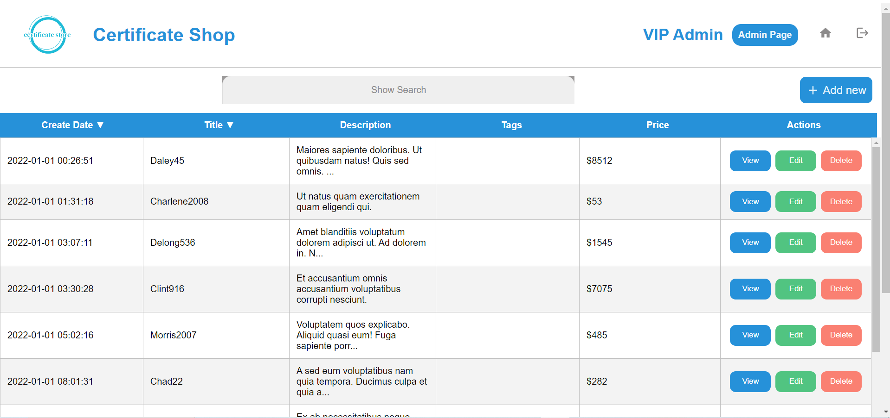
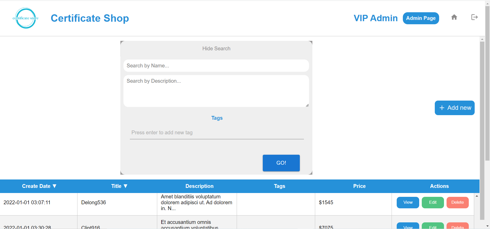
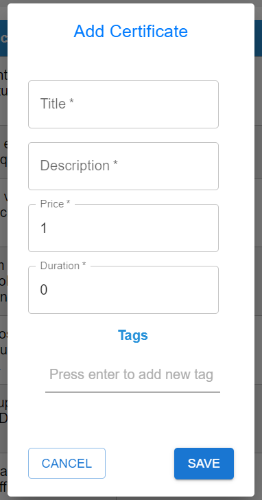
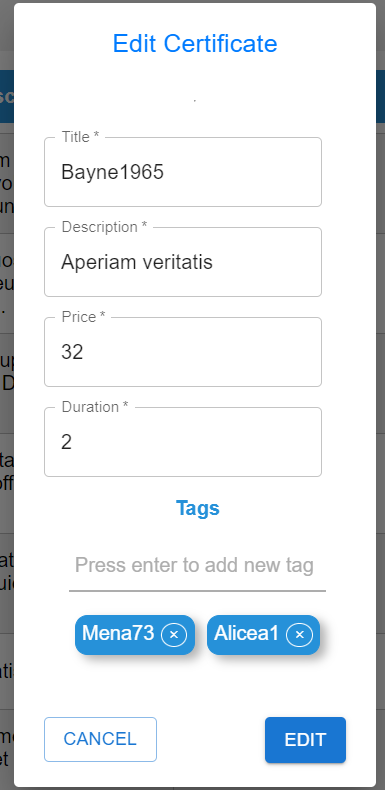
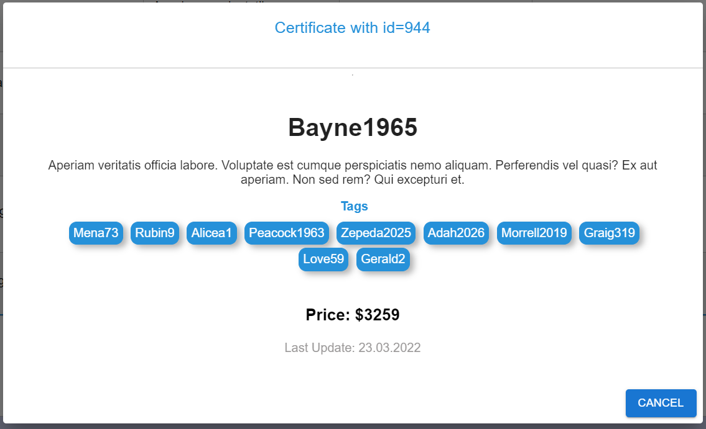
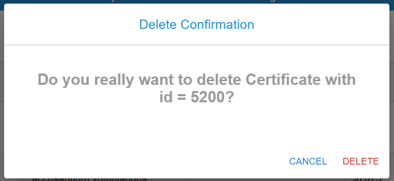

# Certificate Store (frontend)

## Description

Frontend part of Gift Certificate Shop.
 If you're interested in the backend, you can access it by clicking on the following link: [Backend](https://github.com/Vova778/external-java-lab).

***

## General requirements
* Include UI in an executable jar. Running on local dev server only for development purposes.
* Bootstrap can be used.
* Refreshing of a page should not affect pagination.
* Duplication of browser’s tab should lead to exactly the same page (pagination, etc.).Modals may be hidden. Local storage may be used only for security and profile info purposes. All search state should be in url.

* Styles of header and footer should be implemented according to the mockups, should be static and be stuck to the top and on the bottom of the page.

* Code should be readable, easy maintainable and reusable.

* Follow component-based application structure.

* Screenshots of working application should be attached to a merge request.

* In scope of this task backend may be changed a bit, but without rewriting significant amount of code

***

## Application requirements

* The Latest version of React
* EcmaScript, JSX (https://reactjs.org/docs/introducing-jsx.html)
* Node & NPM
* HTML5
* The Latest version of CSS
* Development Environment: Visual Studio Code or any
* Routing in application: transitions between pages handled by a
  react-router. [introducing-react-router](https://reacttraining.com/react-router/native/guides/quick-start)
* Data storage in UI application: [redux](https://redux.js.org/)
* Localization: en - English
* Errors: all forms must be validated, all occurring errors such as 404 or 403 server response should be handled

## Application example

This web-app service includes the following pages and corresponding functionality:

### Home Page

On this Page You can view actual gift certificates and view info about specific ones details. It is possible to go to
the next pages: SignUp, SingIn. 

### Signup

On this Page You can fill the information about yourself required in the form and register in the application. After
successful registration you will be redirected to the Login page. All fields of the registration form are validated so
if any error occurs, a message will immediately be displayed to eliminate it.

### Authentication

On this Page You can fill required account information. Once logged in You will have access to all pages that require
authentication. This Login page also uses some cool inline validation with informing about errors and ways to eliminate
them.

### Gift Certificates Management (Admin)

On this Page You can view all actual gift certificates, get information about each of them, add new gift certificates,
edit existing gift certificates, delete existing gift certificates, search by search term and category and viewing gift
certificates.

  

1. Search Form

  

2. Add new Gift Certificate

  

3. Edit Gift Certificate

  

4. View Gift Certificate

  

5. Delete Gift Certificate

  

